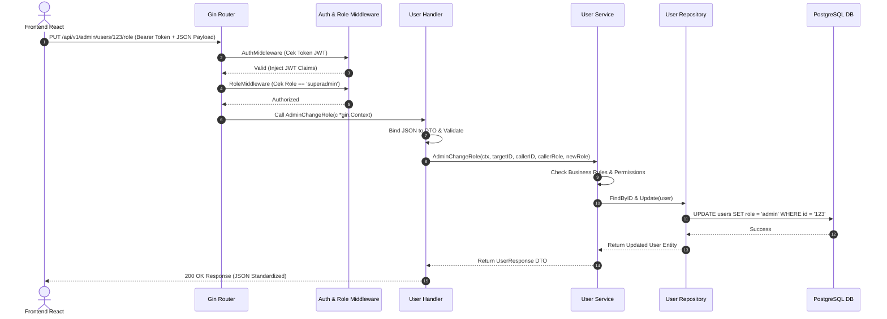

# Dokumentasi Struktur & Arsitektur Backend Go (REST API)

Dokumen ini berisi penjelasan komprehensif mengenai struktur folder, pola arsitektur (*Clean Architecture / Layered Architecture*), alur data, serta tanggung jawab setiap berkas di direktori `backend/`.

---

## 🏗️ Pola Arsitektur (*Standard Go Project Layout*)

Proyek ini menerapkan **Standard Go Project Layout** dengan prinsip **Separation of Concerns (SoC)**. Setiap lapisan (*layer*) memiliki peran independen untuk memudahkan pengujian (*unit testing*), pemeliharaan (*maintainability*), dan skalabilitas proyek.

```
backend/
├── cmd/
│   └── server/
│       └── main.go          # Entry point utama aplikasi
├── internal/                # Kode privat khusus aplikasi ini
│   ├── config/              # Manajemen konfigurasi & env variable
│   ├── database/            # Koneksi PostgreSQL, Auto-Migration, & Seeder
│   ├── dto/                 # Data Transfer Objects (Payload Request & Response)
│   ├── handler/             # Layer HTTP (Menerima request, validasi DTO, kirim response)
│   ├── middleware/          # Middleware Gin (JWT Authentication, RBAC, CORS)
│   ├── model/               # Entitas DB GORM & Konstanta Role
│   ├── repository/          # Layer Database Query (GORM SQL Operations)
│   ├── router/              # Pemetaan URL Endpoints & Grouping Routes
│   ├── service/             # Layer Business Logic (Aturan bisnis & otorisasi)
│   └── validator/           # Helper validasi struct request
├── pkg/                     # Utility / Helper publik reusable
│   ├── hash/                # Hashing password dengan Bcrypt
│   ├── jwt/                 # Generator & Validator Token JWT
│   └── response/            # Standardizer Format JSON API Response
├── .env                     # File variabel lingkungan
├── Dockerfile               # Konfigurasi containerization production
├── go.mod                   # Depedensi Go module
└── go.sum                   # Checksum dependensi Go
```

---

## 📂 Penjelasan Detail Direktori & Lapisan (*Layer*)

### 1. `cmd/server/` (Entrypoint Aplikasi)
- **`main.go`**: Berkas utama tempat aplikasi pertama kali dijalankan.
  - Memuat file konfigurasi `.env`.
  - Menginisialisasi koneksi Database PostgreSQL & Auto Migration.
  - Memicu *Database Seeder* (pembuatan Superadmin otomatis).
  - Mengonfigurasi dependensi (*Dependency Injection* dari Repository → Service → Handler).
  - Menjalankan HTTP Server Gin pada port terkonfigurasi.
  - Mengelola *Graceful Shutdown* saat server dihentikan.

---

### 2. `internal/` (Core Application Business Logic)
Seluruh kode di dalam `internal/` tidak dapat di-import oleh proyek Go lain di luar direktori proyek ini (*Go compiler rule*).

#### A. `internal/model/` (Entity & Data Structures)
Mendefinisikan skema tabel database untuk **GORM** dan konstanta entitas.
- **[user.go](file:///d:/app/go/go-crud-api/backend/internal/model/user.go)**: Struct entitas User (ID UUID, Name, Email, Password, Role, Relasi Posts).
- **[post.go](file:///d:/app/go/go-crud-api/backend/internal/model/post.go)**: Struct entitas Post (ID UUID, Title, Content, Status, UserID, Relasi User).
- **[role.go](file:///d:/app/go/go-crud-api/backend/internal/model/role.go)**: Konstanta role (`user`, `admin`, `superadmin`) dan fungsi pembanding hierarki role.

#### B. `internal/dto/` (Data Transfer Objects)
Mendefinisikan format JSON yang diterima dari frontend (*Request*) dan yang dikirimkan ke frontend (*Response*). Memisahkan representasi JSON dari model database internal.
- **[dto.go](file:///d:/app/go/go-crud-api/backend/internal/dto/dto.go)**:
  - `RegisterRequest`, `LoginRequest`, `AuthResponse`
  - `UpdateUserRequest`, `AdminUpdateUserRequest`, `AdminChangeRoleRequest`
  - `CreatePostRequest`, `UpdatePostRequest`, `PostResponse`
  - `PaginationParam` (paging & search query)

#### C. `internal/repository/` (Database Data Access Layer)
Berurusan langsung dengan database menggunakan **GORM ORM**. Menggunakan *Go Interface* agar gampang di-mock saat testing.
- **[user_repository.go](file:///d:/app/go/go-crud-api/backend/internal/repository/user_repository.go)**: Operasi SQL dasar untuk tabel Users (`Create`, `FindByID`, `FindByEmail`, `FindAll`, `Update`, `Delete`).
- **[post_repository.go](file:///d:/app/go/go-crud-api/backend/internal/repository/post_repository.go)**: Operasi SQL dasar untuk tabel Posts (`Create`, `FindByID`, `FindAll`, `Update`, `Delete`).

#### D. `internal/service/` (Business Logic Layer)
Tempat utama aturan bisnis (*Business Rules*), validasi kepemilikan data (*ownership*), dan hirarki role.
- **[auth_service.go](file:///d:/app/go/go-crud-api/backend/internal/service/auth_service.go)**: Logic registrasi user, login, hashing password, dan pembentukan token JWT access + refresh.
- **[user_service.go](file:///d:/app/go/go-crud-api/backend/internal/service/user_service.go)**: Logic profil user, update profil, serta fitur khusus admin/superadmin (`AdminUpdate`, `AdminChangeRole`, dan proteksi hapus akun).
- **[post_service.go](file:///d:/app/go/go-crud-api/backend/internal/service/post_service.go)**: Logic pembuatan post, verifikasi hak akses edit/hapus post berdasarkan pemilik atau role admin/superadmin.

#### E. `internal/handler/` (HTTP / Controller Layer)
Menerima request HTTP dari klien (Gin Context), melakukan binding JSON/Query ke DTO, memanggil Service Layer, dan mengembalikan HTTP Response.
- **[auth_handler.go](file:///d:/app/go/go-crud-api/backend/internal/handler/auth_handler.go)**: Controller `/auth/register`, `/auth/login`, `/auth/refresh`.
- **[user_handler.go](file:///d:/app/go/go-crud-api/backend/internal/handler/user_handler.go)**: Controller `/users/me`, `/users`, `/admin/users/:id`, `/admin/users/:id/role`.
- **[post_handler.go](file:///d:/app/go/go-crud-api/backend/internal/handler/post_handler.go)**: Controller `/posts` (CRUD).

#### F. `internal/middleware/` (HTTP Interceptors)
- **[middleware.go](file:///d:/app/go/go-crud-api/backend/internal/middleware/middleware.go)**:
  - `AuthMiddleware`: Memvalidasi header `Authorization: Bearer {token}` menggunakan JWT service.
  - `CORSMiddleware`: Menangani Cross-Origin Resource Sharing untuk mengizinkan akses dari frontend Vite (React).
- **[authorization.go](file:///d:/app/go/go-crud-api/backend/internal/middleware/authorization.go)**:
  - `RoleMiddleware`: Membatasi endpoint tertentu agar hanya bisa diakses oleh role yang ditentukan (misalnya `superadmin`).

#### G. `internal/router/` (Route Definition)
- **[router.go](file:///d:/app/go/go-crud-api/backend/internal/router/router.go)**: Mengatur endpoint URL API, mengelompokkan rute (*Route Grouping* `/api/v1`), serta memasang middleware yang sesuai.

#### H. `internal/config/` & `internal/database/`
- **[config.go](file:///d:/app/go/go-crud-api/backend/internal/config/config.go)**: Membaca file `.env` dan *environment variables* OS menggunakan library **Viper**.
- **[database.go](file:///d:/app/go/go-crud-api/backend/internal/database/database.go)**: Mengoneksikan GORM ke PostgreSQL dan menjalankan Auto Migration.
- **[seeder.go](file:///d:/app/go/go-crud-api/backend/internal/database/seeder.go)**: Membuat akun Superadmin awal secara otomatis jika belum ada di DB.

---

### 3. `pkg/` (Shared Utility Helpers)
Direktori paket publik yang dapat digunakan secara independen.
- **[jwt/jwt.go](file:///d:/app/go/go-crud-api/backend/pkg/jwt/jwt.go)**: Modul untuk membuat (*sign*) dan memverifikasi (*validate*) JWT Access Token & Refresh Token.
- **[hash/hash.go](file:///d:/app/go/go-crud-api/backend/pkg/hash/hash.go)**: Wrapper fungsi `bcrypt` untuk keamanan hashing dan pengecekan password.
- **[response/response.go](file:///d:/app/go/go-crud-api/backend/pkg/response/response.go)**: Helper untuk membungkus struktur JSON response standar (`Success`, `Error`, `BadRequest`, `Unauthorized`, `Forbidden`, `NotFound`).

---

## 🔄 Alur Perjalanan Data (*Data Flow Request*)

Ketika klien membuat HTTP Request (misalnya: `PUT /api/v1/admin/users/123/role`):



---

## 💡 Ringkasan Lapisan Arsitektur

| Lapisan | Tanggung Jawab Utama | Tidak Boleh Melakukan |
| :--- | :--- | :--- |
| **Handler** | Membaca HTTP request, memvalidasi JSON payload, memanggil service, mengembalikan HTTP response status. | Menjalankan query SQL langsung, memproses enkripsi/hashing, atau logika aturan bisnis kompleks. |
| **Service** | Logika bisnis utama, otorisasi kepemilikan data, koordinasi panggilan repository. | Mengakses objek `gin.Context` atau berurusan dengan protokol HTTP (Header, Status Code). |
| **Repository**| Eksekusi query database via GORM (CRUD dasar, Join, Pagination). | Memeriksa token JWT atau logika validasi form HTTP. |
| **Model & DTO**| Definisikan struktur tabel database & payload request/response API. | Mengandung method bisnis yang mengubah state database. |
